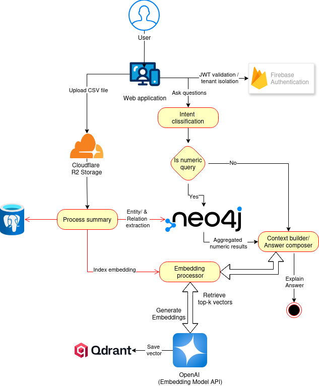

# 📚 Hybrid RAG + Graph-based Question Answering system

---

## 🚀 Overview

This project implements a Hybrid RAG + Graph-based Question Answering system that combines:

- Vector search for semantic retrieval
- Graph queries for numeric and relational reasoning
- LLM-based answer composition with strong grounding

The system is designed to handle both numeric/analytical queries and natural language questions over uploaded CSV data.

---

## High-level Architecture

### Core components:
* Web Application
    * Handles user interaction
    * Authenticated via Firebase (JWT-based tenant isolation)
* Cloudflare R2
    * Stores uploaded CSV files
* Intent Classification
    * Routes queries into numeric vs semantic paths
* Neo4j
    * Stores structured entities and relationships
    * Handles numeric and aggregation-heavy queries
* Embedding Processor
    * Orchestrates embedding generation 
    * Calls external embedding model APIs (OpenAI / Ollama)
    * Indexes and queries vectors
* Qdrant
    * Vector database for semantic retrieval
* Context Builder / Answer Composer
    * Merges graph results and vector context
    * Constructs grounded prompts
    * Produces final answers

---
### Data Ingestion Flow
- User uploads CSV via Web Application
- File is stored in Cloudflare R2
- Ingestion pipeline:
  - Generates summaries
  - Extracts entities and relationships → Neo4j
  - Generates embeddings via Embedding Processor
  - Stores vectors in Qdrant

---
### Query Flow

- User submits a question
- JWT is validated and tenant scope is enforced
- Intent classification determines query type:
  - Numeric query → Neo4j
  - Semantic query → Embedding Processor + Qdrant
- Results are passed to Context Builder
- LLM generates a grounded answer

---
### Why Hybrid RAG?
- Graphs excel at:
  - Numeric reasoning
  - Aggregations
  - Explicit relationships
- Vectors excel at:
  - Semantic similarity
  - Fuzzy and natural language queries
Combining both avoids common RAG pitfalls such as hallucination and poor numeric accuracy.

---
### Design Principles
- Clear separation of concerns
- Vendor-agnostic embedding layer
- Multi-tenant by design
- Scalable ingestion and query paths
- Explainable data flow

### Status
🚧 Work in progress
This repository currently focuses on architecture, ingestion, and retrieval correctness.

## Supported CSV Structure (Current)
The ingestion pipeline currently supports CSV files that represent
time-series or categorical datasets with identifiable entities,
numeric metrics, and optional temporal dimensions.

Typical columns include:
- Entity identifiers (e.g. station, city, region)
- One or more numeric measures
- Optional temporal fields (e.g. year)

The schema is expected to be consistent per dataset. Here is the currently supported csv schema - [CSV Schema](docs/architecture/csv-schema.md)

### Next Steps
+ Improve intent classification
+ Add re-ranking and confidence thresholds
+ Add observability and query tracing